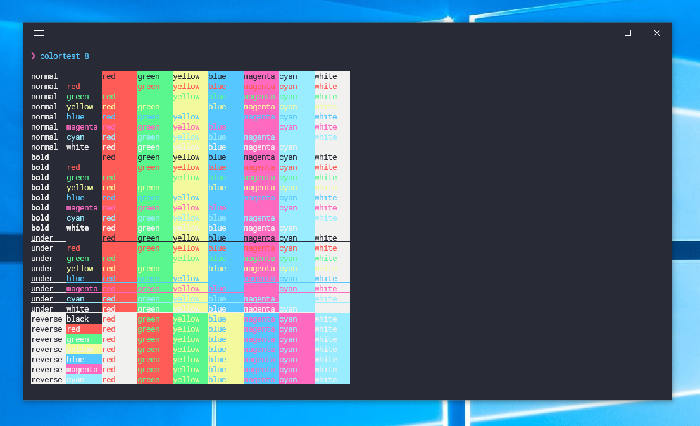
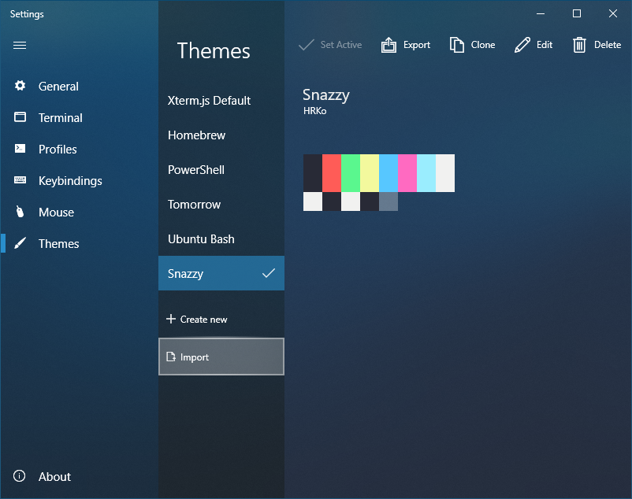

# FluentTerminal-Snazzy
[Fluent Terminal](https://github.com/felixse/FluentTerminal) color theme from [hyper-snazzy](https://github.com/sindresorhus/hyper-snazzy)

# Install
Settings > Themes > Import

